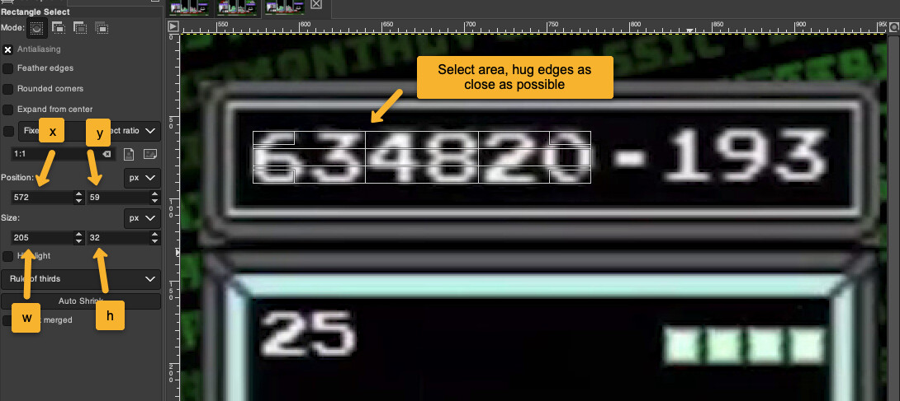
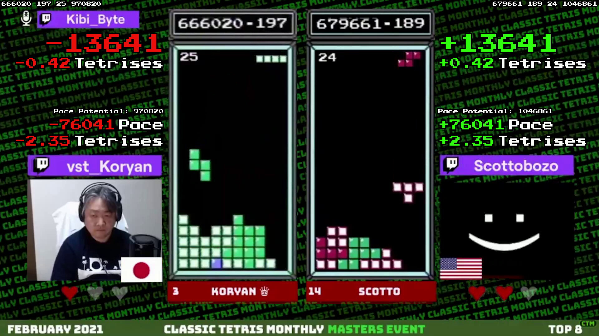
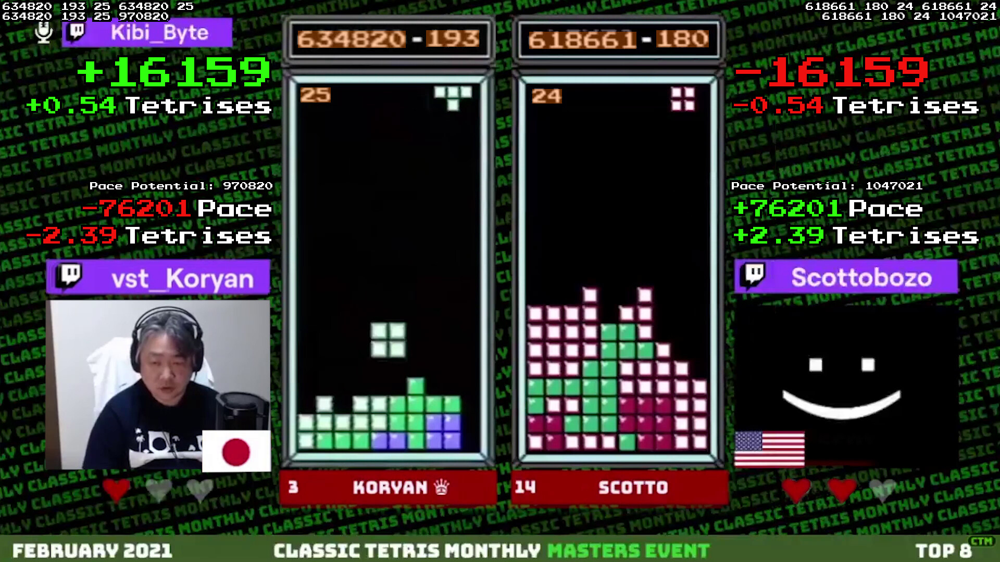

This Repo contains a script to help [aGameScout](https://www.twitch.tv/agamescout) prepare the CTM video with extra stats for his commentary

# Installation

(OSX instruction)

This was only tested in python 3.7.9, so on OSX use it with `brew`:

```bash
brew update
brew install python@3.7
brew link --overwrite python@3.7
pip3 install -r requirements.txt
```

# Usage

Firstly, when installing the program, immediately rename the file `config.example.json` into `config.json`. You will need to edit tunables in `config.json`.

Secondly, have the video segments you want to annotate ready. Do not mix multiple games by multiple players in the same video file, because it is likely the location of their game stats changes a bit.

Instead, cut your video into segment by game to comment on, and then identify the location of the data areas for player 1 and 2 in `(x, y, width, height)` tuples, and populate them the script.

## Tunables

The script needs to OCR both player's score, lines, and level to compute stats. The program user must therefore supply the location of the values in the source video file.

The areas are all described by 4 values:
```javascript
[x, y, width, height]
```
like this:
```javascript
[818, 58, 101, 31]
```

This can be easily easily found in any graphic editor like gimp, like below:



The config file looks like this:
```json
{
	"print_score_difference": true,
	"print_score_potential": true,
	"text_has_border": true,

	"p1_lines_xywh": [818, 58, 101, 31],
	"p1_score_xywh": [572, 59, 206, 32],
	"p1_level_xywh": [577, 168, 57, 28],

	"p2_lines_xywh": [1260, 58, 100, 32],
	"p2_score_xywh": [1016, 61, 205, 32],
	"p2_level_xywh": [1022, 171, 56, 27],

	"p1_score_stats_xy": [525, 110],
	"p1_pace_stats_xy": [525, 350],

	"p2_score_stats_xy": [1405, 110],
	"p2_pace_stats_xy": [1405, 350]
}
```


There are additional tunables in the config file:
```json
{
	"print_score_difference": true,
	"print_score_potential": true,
	"text_has_border": true
}
```

Where
* `print_score_difference`: shows the raw score difference between the players, this can be turned off in case stats get added to a CTWC-like match, where the layout already contains the score difference
* `print_score_potential`: shows the expected maximum score the player can reach upon getting to kill screen (level 29). The pace difference is actually the difference between both player's score potential. Showing the score potential makes it more obvious.
* `text_has_border` Determine whether text shouldbe drawn with thinn border

Finally, stats will be printed in 2 blocks: the score block and the pace block. Each block's location can be tweaked for each player:
```json
{
	"p1_score_stats_xy": [525, 110],
	"p1_pace_stats_xy": [525, 350],

	"p2_score_stats_xy": [1405, 110],
	"p2_pace_stats_xy": [1405, 350]
}
```

Do keep in mind, that the `(x, y)` location above represents the top-right corner for player 1 (because player 1's text is right aligned), and the top-left corner for player 2.


## Running the script

Run the script as:
```bash
python3 generate.py FILEPATH_TO_VIDEO_FILE
```

This will generate a copy of the video file with extension `.out.mp4` with the stats injected.

To verify the OCR is working correctly, the script can be run with `--verify` like this:
```bash
python3 generate.py FILEPATH_TO_VIDEO_FILE --verify
```

That will generate an output video file with extension `.verify.mp4` where the raw values read from the players feeds will be displayed, this will allow the script user to identify problems.

To help with setup and verifying OCR location, you may also instruct to render 1 frame, based on the config by running this:
```bash
python3 generate.py FILEPATH_TO_VIDEO_FILE --verify --snap 10
```

Where `10` indicates picking the 10th frame of the movie. This will generate a frame highlighting the regions that are being captured.


# Sample output


Data presented:
* Score difference betweeen the 2 players, based on current scores
* Score difference in term of tetrises (taking level progression into account)
* Pace score difference
* Pace score difference in term of tetrises

The pace score is computed by projecting the player into the future, starting from their current state of score, lines, and level, and assuming they will score only tetrises all the way into the kill screen. This basically computes the best score they could possibly get in this ongoing game. The projection stops as soon as level reaches level 29. As the projection progresses, the tetris values at the increasing levels are accumulated, until the final pace score emerges.

Some players can play several levels beyond the skill screen, but in the majority of cases, keeping kill screen as the baseline to compute a normalized pace score makes sense.

The pace score is an interesting metric because a player may be ahead in point at a given point in time, but also vastly ahead in lines. That mans his opponent could be doing better overall, but playing a little more slowly. The pace score metrics, by projecting a perfect play onto both players is an indicator of the overall performance in the game so far.

Here is another sample frame showing the verification data on top, the score potential, and the separation of the score and pace stat blocks



And here is another sample with the `--snap 10` options:




## Aknowledgment

OCR-ing the score, lines, level count from the CTM footage is done using the file `digitocr.py` from the excellent [NESTrisOCR](https://github.com/alex-ong/NESTrisOCR) project by [Alex Ong](https://github.com/alex-ong).


## Related Project

This project is pretty much a modified clone of [tetris_rate_adder](https://github.com/timotheeg/tetris_rate_adder), that I made for a similar purpose for [Chris Higgins](https://www.twitch.tv/higginspdx)'s project [Best of Five](https://www.kickstarter.com/projects/chrishiggins/best-of-five-the-classic-tetris-champions).

Take a look at [NESTrisStatsUI](https://github.com/timotheeg/NESTrisStatsUI) for a project computing Tetris stats from a live tetris games.